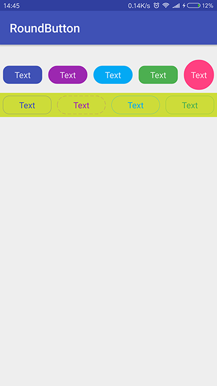

# roundbutton
 
[](https://jitpack.io/#czy1121/roundbutton)
 
gi   

通过调节色彩明度自动计算按下(pressed)状态颜色



## Gradle

``` groovy
repositories { 
    maven { url "https://jitpack.io" }
}
```  
    
``` groovy
dependencies {
    compile 'com.github.czy1121:roundbutton:1.0.0'
}
```
    
## Usage
    
**XML**

``` xml
<com.github.czy1121.view.RoundButton
    style="@style/RoundButton"
    android:text="Text"
    app:btnCornerRadius="10dp" 
    app:btnSolidColor="#3F51B5"/>
    
<com.github.czy1121.view.RoundButton
    style="@style/RoundButton.Two"
    android:text="Text"
    android:textColor="#3F51B5"
    app:btnCornerRadius="10dp"
    app:btnPressedRatio="1.5"
    app:btnStrokeColor="#3F51B5"/>
``` 

**属性**

``` xml 
<declare-styleable name="RoundButton">
    <!-- 背景色 -->
    <attr name="btnSolidColor" format="color"/>
    <!-- 边框色 -->
    <attr name="btnStrokeColor" format="color"/>
    <!-- 边框厚度 -->
    <attr name="btnStrokeWidth" format="dimension"/>
    <!-- 边框长度 -->
    <attr name="btnStrokeDashWidth" format="dimension"/>
    <!-- 边框间隙 -->
    <attr name="btnStrokeDashGap" format="dimension"/>
    <!-- 圆角半径，stadium 表示半径为 min(height,width) / 2-->
    <attr name="btnCornerRadius" format="dimension">
        <enum name="stadium" value="-1"/>
    </attr>
    <!-- 自动计算按下(pressed)状态颜色的系数, 值为0时不自动计算 -->
    <attr name="btnPressedRatio" format="float"/>
</declare-styleable>
```
 

## License

```
Copyright 2016 czy1121

Licensed under the Apache License, Version 2.0 (the "License");
you may not use this file except in compliance with the License.
You may obtain a copy of the License at

   http://www.apache.org/licenses/LICENSE-2.0

Unless required by applicable law or agreed to in writing, software
distributed under the License is distributed on an "AS IS" BASIS,
WITHOUT WARRANTIES OR CONDITIONS OF ANY KIND, either express or implied.
See the License for the specific language governing permissions and
limitations under the License.
```